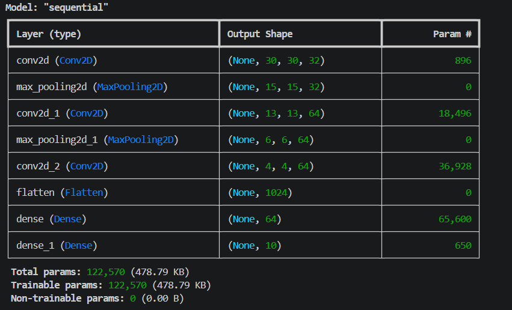
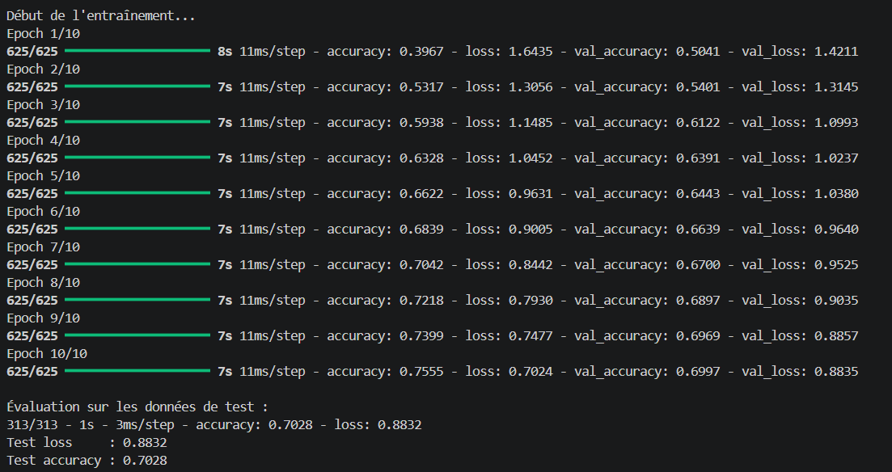
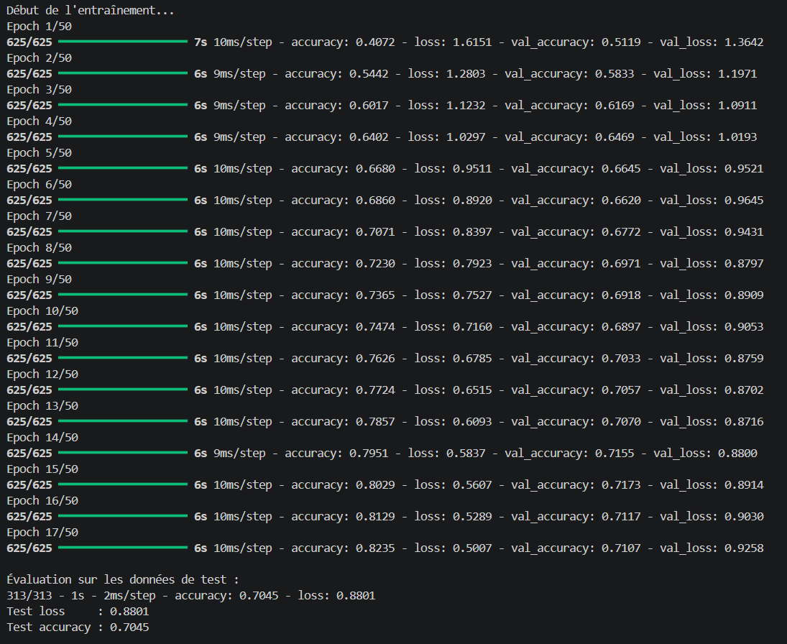

# Notes pour le rapport

## Introduction
Ce projet consiste à réaliser une classification d'images à l'aide d'un réseau de neurones convolutif, appelé CNN.

## Pourquoi un CNN ?
Un CNN est adapté aux images car il conserve la structure spatiale des pixels. Les couches de convolution permettent de détecter automatiquement des formes simples au début, puis des motifs plus complexes dans les couches profondes.

## Dataset utilisé

Le modèle a été entraîné sur le dataset CIFAR-10.  
CIFAR-10 est un jeu de données composé de 60 000 images couleur de taille 32x32 pixels, réparties en 10 catégories : avion, automobile, oiseau, chat, cerf, chien, grenouille, cheval, bateau et camion.

Le dataset contient 50 000 images d'entraînement et 10 000 images de test.  
Dans ce projet, une partie des images d'entraînement a aussi été utilisée comme données de validation afin de suivre les performances du modèle pendant l'apprentissage.

## Architecture utilisée
Le modèle contient :

- des couches `Conv2D` pour extraire les caractéristiques ;
- des couches `MaxPooling2D` pour réduire la dimension ;
- une couche `Flatten` pour transformer les cartes de caractéristiques en vecteur ;
- des couches `Dense` pour effectuer la classification ;
- une couche finale `softmax` pour obtenir une probabilité par classe.

## Entraînement
Le modèle est entraîné avec l'optimiseur Adam et la fonction de perte `categorical_crossentropy`, adaptée à une classification multi-classes.

## Conclusion provisoire
Le CNN permet d'apprendre automatiquement les caractéristiques importantes des images, sans extraction manuelle. Les résultats peuvent être améliorés avec plus d'epochs, de la data augmentation ou une architecture plus avancée.

## Résultats obtenus

Le modèle CNN a été entraîné pendant 10 epochs sur le dataset CIFAR-10.

Résultats finaux :

- Accuracy entraînement : 75,55 %
- Loss entraînement : 0,7024
- Accuracy validation : 69,97 %
- Loss validation : 0,8835
- Accuracy test : 70,28 %
- Loss test : 0,8832

Ces résultats montrent que le modèle apprend correctement à classifier les images. L’accuracy augmente progressivement au fil des epochs, passant d’environ 39,67 % à 75,55 % sur l’entraînement.  
L’accuracy de validation atteint environ 69,97 %, ce qui indique que le modèle généralise plutôt bien sur des images qu’il n’a pas vues pendant l’apprentissage.

## Architecture du modèle

Le modèle utilisé est un réseau de neurones convolutionnel composé de :

- 3 couches de convolution Conv2D ;
- 2 couches MaxPooling2D ;
- 1 couche Flatten ;
- 1 couche Dense cachée de 64 neurones ;
- 1 couche Dense finale de 10 neurones pour les 10 classes de CIFAR-10.

Le modèle contient au total 122 570 paramètres entraînables.

Les couches de convolution permettent d’extraire des caractéristiques visuelles comme les contours, les textures et les formes.  
Les couches de pooling réduisent la taille des représentations afin de diminuer le coût de calcul et de rendre le modèle plus robuste.  
La couche finale utilise une classification sur 10 classes.

## Entraînement avec EarlyStopping

Une seconde expérience a été réalisée avec un maximum de 50 epochs et un mécanisme d'EarlyStopping.  
L'objectif était de laisser le modèle s'entraîner plus longtemps tout en évitant le surapprentissage.

L'entraînement s'est arrêté automatiquement à l'epoch 17, car la loss de validation ne s'améliorait plus suffisamment.  
Le meilleur niveau de validation a été observé autour de l'epoch 12, avec une val_loss de 0,8702.

Le modèle final obtient une accuracy de test de 70,45 %.  
Ce résultat est très proche du premier entraînement à 10 epochs, qui obtenait 70,28 %.  
Cela montre qu'augmenter simplement le nombre d'epochs ne suffit pas forcément à améliorer fortement les performances.

On observe aussi un début de surapprentissage : l'accuracy d'entraînement continue d'augmenter jusqu'à 82,35 %, tandis que l'accuracy de validation reste autour de 71 %.  
L'EarlyStopping permet donc d'éviter de continuer un entraînement inutilement long.

